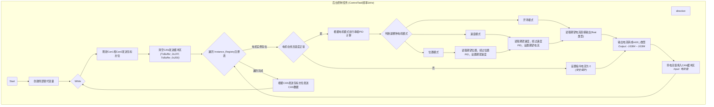
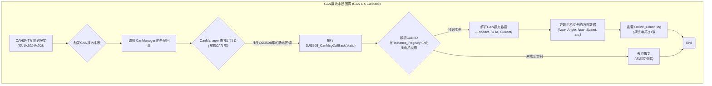

# DJI3508 电机控制库使用说明

## 版本信息

- **库版本 (Version):** 1.1
- **最后更新日期 (Last Updated):** 2025-11-16
- **兼容性 (Compatibility):**
  - **硬件 (Hardware):** 大疆 DJI M3508i 无刷直流电机 + C620 电调
  - **固件 (Firmware):** 基于 FreeRTOS 的嵌入式系统
  - **依赖 (Dependencies):** `B2MW_CANManager`, `PID_Controller`

---

## 目录

- [DJI3508 电机控制库使用说明](#dji3508-电机控制库使用说明)
  - [版本信息](#版本信息)
  - [目录](#目录)
  - [1. 功能描述 (Public API)](#1-功能描述-public-api)
    - [1.1. `DJI3508::DJI3508()`](#11-dji3508dji3508)
    - [1.2. `MW_Status DJI3508::Init()`](#12-mw_status-dji3508init)
    - [1.3. `MW_Status DJI3508::StartControlTask()`](#13-mw_status-dji3508startcontroltask)
    - [1.4. `MW_Status DJI3508::SetExpect()`](#14-mw_status-dji3508setexpect)
    - [1.5. `C620_FeedBackMsg DJI3508::getC620FeedBackMsg()`](#15-c620_feedbackmsg-dji3508getc620feedbackmsg)
    - [1.6. `MW_Status DJI3508::SetPIDControllerMode()`](#16-mw_status-dji3508setpidcontrollermode)
    - [1.7. `DJI3508::~DJI3508()`](#17-dji3508dji3508)
  - [2. 实现细节 (Implementation Details)](#2-实现细节-implementation-details)
    - [2.1. 核心算法流程图 (Core Algorithm Flowchart)](#21-核心算法流程图-core-algorithm-flowchart)
    - [2.2. 关键数据结构 (Key Data Structures)](#22-关键数据结构-key-data-structures)
    - [2.3. 硬件接口要求 (Hardware Interface Requirements)](#23-硬件接口要求-hardware-interface-requirements)
    - [2.4. 异常处理机制 (Exception Handling)](#24-异常处理机制-exception-handling)
  - [3. 使用示例 (Usage Examples)](#3-使用示例-usage-examples)
    - [3.1. 完整初始化代码示例](#31-完整初始化代码示例)
    - [3.2. 典型控制场景示例](#32-典型控制场景示例)
    - [3.3. 常见问题排查指南 (FAQ)](#33-常见问题排查指南-faq)
    - [3.4. 性能指标和限制说明](#34-性能指标和限制说明)
  - [4. 版本更新日志 (Changelog)](#4-版本更新日志-changelog)

---

## 1. 功能描述 (Public API)

本节详细介绍所有用户可直接调用的公开函数。

### 1.1. `DJI3508::DJI3508()`

- **函数原型 (Prototype):**
  ```cpp
  DJI3508(DJI3508_ID motorID,
          USE_CanBus canBus,
          Can::CanBaudRate baudRate,
          PID_Param& Location_PID_Param,
          PID_Param& Speed_PID_Param,
          DJI3508_ControlMode controlMode = DJI3508_OpenLoopMode,
          Can::CanMode mode = Can::CanMode::MODE_NORMAL);
  ```

- **输入参数 (Parameters):**
  - **`motorID` (`DJI3508_ID`): 电机ID，必须为 `DJI3508_1` 到 `DJI3508_8` 之一。**
  - **`canBus` (`USE_CanBus`): 使用的CAN总线**，如 `USE_CAN1` 或 `USE_CAN2`。
  - `baudRate` (`Can::CanBaudRate`): CAN总线波特率，如 `Can::CanBaudRate::BAUD_1M`。
  - `Location_PID_Param` (`PID_Param&`): 位置环PID参数结构体引用。
  - `Speed_PID_Param` (`PID_Param&`): 速度环PID参数结构体引用。
  - `controlMode` (`DJI3508_ControlMode`): 初始控制模式，默认为开环电流模式 (`DJI3508_OpenLoopMode`)。
  - `mode` (`Can::CanMode`): CAN总线模式，默认为正常模式 (`Can::CanMode::MODE_NORMAL`)。

- **返回值 (Return Value):**
  无 (构造函数)。

- **功能描述 (Description):**
  该构造函数是使用本库的第一步，用于创建一个DJI3508电机实例。它不仅仅是简单地初始化对象的成员变量，更核心的作用是执行了本库架构的关键一步：**实例注册**。**在函数内部，`this` 指针（即当前创建的电机实例）会被存储到一个静态的全局实例注册表 `Instance_Registry` 数组中。该数组通过 `motorID` 进行索引，使得库的后台控制任务能够集中管理和访问所有已创建的电机对象**。这种**注册表设计模式**解耦了电机对象的创建和其实际的控制执行，允许多个电机实例共享同一个后台控制任务，极大地提高了系统的效率和可扩展性。此外，构造函数还会绑定 `CanManager` 的单例，为后续的CAN通信做准备，并根据传入的参数初始化PID控制器和默认控制模式。用户必须为每个物理电机创建一个对应的 `DJI3508` 实例，并确保 `motorID` 的唯一性。

- **使用场景和示例 (Usage & Example):**
  在系统初始化阶段，为每一个需要控制的M3508电机创建一个对象实例。
  
  ```cpp
  // 定义PID参数
  PID_Param location_pid = { .Kp = 1.0f, .Ki = 0.0f, .Kd = 0.0f, ... };
  PID_Param speed_pid = { .Kp = 100.0f, .Ki = 50.0f, .Kd = 0.5f, ... };
  
  // 创建一个ID为1，使用CAN1，初始为速度闭环模式的电机实例
  DJI3508 motor1(DJI3508_1, USE_CAN1, Can::CanBaudRate::BAUD_1M,
                location_pid, speed_pid, DJI3508_SpeedLoopMode);
  ```

### 1.2. `MW_Status DJI3508::Init()`

- **函数原型 (Prototype):**
  ```cpp
  MW_Status Init();
  ```

- **输入参数 (Parameters):**
  无。

- **返回值 (Return Value):**
  `MW_Status`: `MW_Status::SUCCESS` 表示成功, `MW_Status::ERROR` 表示失败。

- **功能描述 (Description):**
  **`Init()` 函数负责电机实例所依赖的底层硬件资源的初始化和配置**。调用此函数后，它会首先通过 `CanManager` 单例来申请并启动指定的CAN总线（前提是尚未启动CAN总线的情况）。随后，本函数会执行另一个核心操作：**订阅CAN消息**。**它会将一个静态的回调函数 `DJI3508_CanMsgCallBack` 注册到 `CanManager` 中**，**并与当前电机实例的 `motorID` 绑定。**这意味着，**当CAN总线上出现对应ID（如 `0x201`）的反馈报文时，`CanManager` 会自动调用这个静态回调函数。该回调函数内部实现了报文路由逻辑，能够根据报文ID找到之前在构造函数中注册的、正确的 `DJI3508` 实例，并将解析后的数据（如转速、角度、电流）更新到该实例的内部变量中**。因此，`Init()` 不仅是初始化硬件，更是建立起了从CAN总线硬件到特定电机对象实例的数据流通道。**必须在构造函数之后，为每个电机实例调用一次。**

- **使用场景和示例 (Usage & Example):**
  在创建电机实例后，立即对其进行初始化。
  
  ```cpp
  // 假设motor1已经创建
  if (motor1.Init() != MW_Status::SUCCESS) {
      // 初始化失败，进行错误处理
      printf("Motor 1 initialization failed!\r\n");
  }
  ```

### 1.3. `MW_Status DJI3508::StartControlTask()`

- **函数原型 (Prototype):**
  ```cpp
  MW_Status StartControlTask(void);
  ```

- **输入参数 (Parameters):**
  无。

- **返回值 (Return Value):**
  `MW_Status`: `MW_Status::SUCCESS` 表示成功, `MW_Status::ERROR` 表示失败。

- **功能描述 (Description):**
  **此函数用于创建并启动整个DJI3508电机库的唯一后台控制任务**。这是一个基于FreeRTOS的任务，以1kHz的频率周期性执行。为了保证系统中只有一个控制任务在运行，函数内部使用了临界区 (`taskENTER_CRITICAL`) 和对静态任务句柄 `ControlTaskHandle` 的检查，确保了即使该函数被多次调用，任务也只会被创建一次。这个后台任务是本库的“心脏”，**它的核心职责是：遍历静态实例注册表 `Instance_Registry` 中的所有电机实例，检查它们的在线状态，根据每个电机当前的控制模式（位置、速度或开环）和期望值 (`Exp_Angle`, `Exp_Speed`, `Exp_Current`)，执行相应的PID计算（串级PID），并将最终计算出的电流指令值填充到静态的CAN发送缓冲区中。在遍历完所有电机后，任务会统一将包含所有电机指令的CAN报文（ID为 `0x1FF` 和 `0x200`）一次性发送出去**。这种集中式的控制方式，确保了所有电机的控制指令能够同步、高效地发送，并极大简化了用户的使用逻辑。用户无需关心多线程和定时器，只需调用此函数一次即可启动所有电机的控制循环。

- **使用场景和示例 (Usage & Example):**
  在所有电机实例都完成 `Init()` 后，调用一次此函数来启动后台控制。
  
  ```cpp
  // 假设motor1, motor2均已初始化
  if (motor1.StartControlTask() != MW_Status::SUCCESS) {
      // 任务创建失败
      printf("Failed to start DJI3508 control task!\r\n");
  }
  // 注意：无需对motor2再次调用，因为任务是共享的
  ```

### 1.4. `MW_Status DJI3508::SetExpect()`

- **函数原型 (Prototype):**
  ```cpp
  MW_Status SetExpect(float32_t exp);
  ```

- **输入参数 (Parameters):**
  - **`exp` (`float32_t`): 期望的目标值。其单位和物理意义取决于电机当前的控制模式**：
    - **`DJI3508_LocationLoopMode`: 角度 (Angle)，单位：度 (°)。**
    - **`DJI3508_SpeedLoopMode`: 速度 (Velocity)，单位：弧度/秒 (rad/s)。**
    - **`DJI3508_OpenLoopMode`: 电流 (Current)，单位：毫安 (mA)。**

- **返回值 (Return Value):**
  `MW_Status`: 始终返回 `MW_Status::SUCCESS`。

- **功能描述 (Description):**
  `SetExpect` 是用户与电机交互最主要的接口，用于设定电机的运动目标。**作用就是将传入的期望值 `exp` 写入到电机实例内部对应的成员变量中（`MotorData.Exp_Angle`, `MotorData.Exp_Speed`, 或 `MotorData.Exp_Current`）**。实际的控制逻辑并不在此函数中执行。真正的计算发生在后台的 `ControlTask` 中。`ControlTask` 在每个周期（1ms）运行时，会主动读取这些被 `SetExpect` 更新过的期望值，并将其作为PID控制器的输入目标。这种设计将用户的“意图设定”与后台的“控制执行”完全分离开。**用户可以在任何时候、任何任务中调用 `SetExpect` 来更新电机目标，而无需担心线程安全或时序问题，因为数据的读取和使用是由后台任务同步处理的。函数内部还包含了对输入值的约束 (`Constrain`)，例如限制电流和速度在电机的额定范围内，以保证安全。**

- **使用场景和示例 (Usage & Example):**
  在主循环或任何业务逻辑任务中，根据需要更新电机目标。
  
  ```cpp
  // 场景1: 位置控制，让电机转到90度
  // motor1.SetControlMode(DJI3508_LocationLoopMode); // 假设已设置为位置模式
  motor1.SetExpect(90.0f);
  
  // 场景2: 速度控制，让电机以 10.5 rad/s 的速度旋转
  // motor1.SetControlMode(DJI3508_SpeedLoopMode); // 假设已设置为速度模式
  motor1.SetExpect(10.5f);
  
  // 场景3: 开环电流控制，输出 500mA 电流
  // motor1.SetControlMode(DJI3508_OpenLoopMode); // 假设已设置为开环模式
  motor1.SetExpect(500.0f);
  ```

### 1.5. `C620_FeedBackMsg DJI3508::getC620FeedBackMsg()`

- **函数原型 (Prototype):**
  ```cpp
  C620_FeedBackMsg getC620FeedBackMsg();
  ```

- **输入参数 (Parameters):**
  无。

- **返回值 (Return Value):**
  `C620_FeedBackMsg`: 一个包含电机原始反馈数据的结构体。

- **功能描述 (Description):**
  **此函数提供了一个直接访问电机最原始反馈数据的通道。当CAN总线收到C620电调的反馈报文后，`DJI3508_CanMsgCallBack` 会将报文中的原始数据（未经过加工的编码器值、RPM转速、电流值和温度）直接填充到一个名为 `FeedBackMsg` 的 `C620_FeedBackMsg` 结构体成员中。调用此函数，返回的就是这个结构体的一份拷贝。这对于需要进行底层数据分析、调试或实现特殊算法（如系统辨识）的用户非常有用**。例如，用户可以直接获取转子的原始编码器值（0-8191）来进行高精度的角度计算，或者获取原始的RPM值进行分析。需要注意的是，此函数返回的是未经库内部处理的“裸数据”，而库内部用于PID控制的速度和角度值（如 `MotorData.Now_Speed`）是经过了单位转换和圈数累计等处理的。

- **使用场景和示例 (Usage & Example):**
  用于调试或获取高分辨率的原始传感器数据。
  ```cpp
  C620_FeedBackMsg raw_data = motor1.getC620FeedBackMsg();
  printf("Raw Encoder: %d, RPM: %d, Current: %d\r\n",
         raw_data.Encoder, raw_data.RPM, raw_data.Current);
  ```

### 1.6. `MW_Status DJI3508::SetPIDControllerMode()`

- **函数原型 (Prototype):**
  ```cpp
  MW_Status SetPIDControllerMode(DJI3508_PID_LOOP Loop,
                                PID_D_First_Mode D_First_Mode,
                                PID_I_Limit_Mode I_Limit_Mode,
                                PID_DeedZone_Mode DeedZone_Mode,
                                PID_I_Separate_Mode I_Separate_Mode,
                                PID_I_VarSpeed_Mode I_VarSpeed_Mode,
                                PID_Output_Limit_Mode Output_Limit_Mode,
                                PID_FeedForward_Mode FeedForward_Mode);
  ```

- **输入参数 (Parameters):**
  - `Loop` (`DJI3508_PID_LOOP`): 指定要配置哪个环路，`DJI3508_SpeedPIDLoop` 或 `DJI3508_LocationPIDLoop`。
  - `...Modes`: 各种PID功能模式的枚举值，用于开启或关闭如积分限幅、微分先行、变速积分等高级功能。

- **返回值 (Return Value):**
  `MW_Status`: `MW_Status::SUCCESS` 或 `MW_Status::ERROR`。

- **功能描述 (Description):**
  这是一个高级配置函数，**允许用户精细地调整内部PID控制器的行为。标准的PID控制器只有P、I、D三个参数，但本库依赖的 `PID_Controller` 组件实现了很多高级算法以改善控制效果**。例如，“积分分离” (`I_Separate_Mode`) 可以在误差较大时关闭积分，防止积分饱和；“变速积分” (`I_VarSpeed_Mode`) 可以让积分速度根据误差大小变化；“微分先行” (`D_First_Mode`) 可以减少设定值突变带来的冲击。此函数就是将这些高级功能的配置项暴露给用户。通过传入不同的模式枚举值，用户可以为位置环或速度环定制一套最适合自己应用场景的PID策略。例如，对于需要快速响应且能容忍一定超调的系统，可以开启前馈；对于负载变化剧烈的系统，可以开启积分限幅。这为高级用户提供了优化电机动态性能的强大工具。

- **使用场景和示例 (Usage & Example):**
  在初始化后，对特定环路的PID行为进行深度定制。
  ```cpp
  // 为速度环开启积分限幅和输出限幅
  motor1.SetPIDControllerMode(DJI3508_SpeedPIDLoop,
                              PID_D_First_DISABLE,
                              PID_I_Limit_ENABLE, // 开启积分限幅
                              PID_DeedZone_DISABLE,
                              PID_I_Separate_DISABLE,
                              PID_I_VarSpeed_DISABLE,
                              PID_Output_Limit_ENABLE, // 开启输出限幅
                              PID_FeedForward_DISABLE);
  ```

### 1.7. `DJI3508::~DJI3508()`

- **函数原型 (Prototype):**
  ```cpp
  ~DJI3508();
  ```

- **输入参数 (Parameters):**
  无。

- **返回值 (Return Value):**
  无 (析构函数)。

- **功能描述 (Description):**
  析构函数负责在电机对象被销毁时，释放其占有的系统资源。它的主要工作包括：

  1. **取消CAN消息订阅**：它会调用 `CanManagerPtr->UnSubscribe()`，告知 `CanManager` 不再需要监听与此电机ID相关的CAN反馈报文。这可以防止悬空指针和不必要的回调。
  2.  **注销实例**：它会将 `Instance_Registry` 中对应槽位置为 `nullptr`，从而将自身从全局实例注册表中移除。这样，后台控制任务在下一次遍历时就会自动忽略这个已被销毁的实例。
  3.  **解绑 `CanManager`**：将内部的 `CanManagerPtr` 指针置空。虽然在典型的静态分配嵌入式应用中，对象生命周期与程序运行周期相同，析构函数很少被显式调用，但对于使用动态内存分配（如 `new`/`delete`）的复杂系统，正确实现析构函数是保证系统稳定、防止资源泄漏的关键。
  
- **使用场景和示例 (Usage & Example):**
  当电机对象是通过 `new` 动态创建时，`delete` 会自动调用此析构函数。
  ```cpp
  DJI3508* motor_ptr = new DJI3508(...);
  // ... use motor_ptr ...
  delete motor_ptr; // 析构函数被调用，资源被释放
  ```

---

## 2. 实现细节 (Implementation Details)

### 2.1. 核心算法流程

本库的运行分为两个完全独立且并行的核心流程：**后台控制任务**和**CAN接收中断回调**。它们通过全局的`Instance_Registry`（实例注册表）来交换数据，实现了控制指令下发与状态数据反馈的解耦。

#### 2.1.1. 后台控制任务 (ControlTask)

这是一个基于FreeRTOS的周期性任务，以**1kHz**的频率精确运行。它是整个控制系统的“心脏”，负责将用户的期望值（如速度、角度）通过PID控制器转化为具体的电流指令，并统一下发给所有电机。



#### 2.1.2. CAN接收中断回调 (CAN RX Callback)

这是一个由硬件中断驱动的事件处理流程。当CAN控制器接收到来自C620电调的反馈报文时，该流程被触发。它的核心职责是解析报文，并将最新的电机状态（如转速、角度、温度）准确无误地更新到对应的电机实例中，为后台控制任务提供决策依据。



### 2.2. 关键数据结构 (Key Data Structures)

- **`C620_FeedBackMsg`**: 存储从C620电调直接收到的原始数据。
  | 成员 (Member) | 类型 (Type) | 描述 (Description) |
  | :--- | :--- | :--- |
  | `Encoder` | `uint16_t` | 转子机械角度，范围 `0` - `8191` |
  | `RPM` | `int16_t` | 转子转速，单位：转/分钟 (RPM) |
  | `Current` | `int16_t` | 实际电流，范围 `-16384` - `16384` 映射到 `-20A` - `+20A` |
  | `Temperature` | `int8_t` | 电调温度，单位：摄氏度 (°C) |

- **`DJI3508_Data`**: 存储经过库处理和计算后的电机状态数据。
  | 成员 (Member) | 类型 (Type) | 描述 (Description) |
  | :--- | :--- | :--- |
  | `Exp_Angle` | `float32_t` | 期望角度 (°) |
  | `Exp_Speed` | `float32_t` | 期望速度 (rad/s) |
  | `Exp_Current` | `float32_t` | 期望电流 (mA) |
  | `Now_Angle` | `float32_t` | 当前输出轴角度 (°) (已计圈) |
  | `Now_Speed` | `float32_t` | 当前输出轴速度 (rad/s) |
  | `Now_Current` | `float32_t` | 当前电流 (mA) |
  | `Total_Encoder` | `int32_t` | 累计编码器值 (已计圈) |
  | `Online_CountFlag`| `int32_t` | 在线状态计数器，用于离线检测 |

- **`Instance_Registry`**:
  这是一个 `DJI3508*` 类型的静态数组，是实现多电机管理的核心。当一个 `DJI3508` 对象被构造时，它会根据自己的 `MotorID` 将 `this` 指针存入数组的 `[MotorID - 0x201]` 位置。后台任务和CAN回调通过访问这个全局唯一的注册表，实现了对所有电机实例的集中控制和数据分发。

### 2.3. 硬件接口要求 (Hardware Interface Requirements)

- **CAN总线 (CAN Bus):**
  - 必须有一个或两个可用的CAN外设。
  - 波特率 (Baud Rate) 可配置，通常为 `1Mbps`。
  - CAN总线必须有正确的终端电阻（通常为120欧姆）。
  - 本库使用的CAN ID:
    - 发送: `0x1FF` (电机ID 5-8), `0x200` (电机ID 1-4)
    - 接收: `0x201` - `0x208` (对应电机ID 1-8)

- **RTOS:**
  - 必须有 FreeRTOS 环境。
  - `ControlTask` 默认以 `1kHz` 频率运行，需要系统提供足够的CPU性能来保证实时性，尤其是在控制多个电机时。任务优先级设置为 `24`，栈大小为 `512` words。

### 2.4. 异常处理机制 (Exception Handling)

- **断言机制 (Assertion):**
  - 通过 `DJI3508_ASSERT(status, msg)` 宏实现。
  - 在调用底层中间件（如 `CanManager`）后，会检查其返回值。如果返回 `ERROR`，断言将被触发。
  - 触发后会调用全局的 `MW_AssertStatusFailedHandle` 函数，打印详细的错误信息（模块、文件、行号）并进入死循环，防止系统在错误状态下继续运行。

- **离线保护 (Offline Protection):**
  - 每个电机实例内部有一个 `Online_CountFlag` 计数器。
  - CAN接收回调每次成功收到数据后，会重置此计数器。
  - `ControlTask` 每个周期会递减此计数器。
  - 如果计数器减到0（意味着超过 `10ms` 未收到反馈），`ControlTask` 会将电机状态置为 `DJI3508_Offline`，并强制将该电机的输出电流设为0，以防止失控。

- **过温保护 (Over-Temperature Protection):**
  - `ControlTask` 会检查反馈报文中的温度值。
  - 如果温度超过 `DJI3508_CharacterParam::MaxTemperature`，电机会被置于 `DJI3508_OverTemperature` 状态，同样输出电流为0。
  - 当温度恢复到安全范围后，状态会自动切换回 `DJI3508_Online`。

---

## 3. 使用示例 (Usage Examples)

### 3.1. 完整初始化代码示例

```cpp
#include "DJI3508.hpp"

// 1. 定义PID参数
PID_Param location_pid_param = {
    .Kp = 1.2f, .Ki = 0.0f, .Kd = 0.0f,
    .I_Limit = 100.0f, .Output_Limit = DJI3508_CharacterParam::Rated_GearBoxRad
};
PID_Param speed_pid_param = {
    .Kp = 150.0f, .Ki = 80.0f, .Kd = 0.5f,
    .I_Limit = 3000.0f, .Output_Limit = DJI3508_CharacterParam::Rated_Current_mA
};

// 2. 创建电机实例 (全局或静态)
DJI3508 motor1(DJI3508_1, USE_CAN1, Can::CanBaudRate::BAUD_1M,
              location_pid_param, speed_pid_param, DJI3508_SpeedLoopMode);

DJI3508 motor2(DJI3508_2, USE_CAN1, Can::CanBaudRate::BAUD_1M,
              location_pid_param, speed_pid_param, DJI3508_OpenLoopMode);

// 3. 在主函数或初始化任务中执行
void User_Init() {
    // 4. 初始化每个电机
    if (motor1.Init() != MW_Status::SUCCESS) {
        // 处理错误
    }
    if (motor2.Init() != MW_Status::SUCCESS) {
        // 处理错误
    }

    // 5. 启动唯一的后台控制任务 (只需调用一次)
    if (motor1.StartControlTask() != MW_Status::SUCCESS) {
        // 处理错误
    }
    
    printf("All DJI motors initialized and control task started.\r\n");
}
```

### 3.2. 典型控制场景示例

```cpp
// 假设在某个用户任务中
void User_Control_Loop() {
    // 场景1: 速度控制 - 让 motor1 以 20 rad/s 旋转
    // 注意：该模式已在构造时设置
    motor1.SetExpect(20.0f);

    // 场景2: 开环电流控制 - 让 motor2 输出 800mA 电流
    // 注意：该模式已在构造时设置
    motor2.SetExpect(800.0f);

    // 场景3: 位置控制 - 让 motor1 转到 360 度位置
    // 需要先切换模式 (假设已实现SetControlMode函数, 若无则需重新构造)
    // motor1.SetControlMode(DJI3508_LocationLoopMode);
    // motor1.SetExpect(360.0f);

    vTaskDelay(pdMS_TO_TICKS(10)); // 任务延时
}
```

---

## 4. 版本更新日志 (Changelog)

### v1.1 (2025-11-16)
- **[新增]** 增加了过温保护和离线保护机制。
- **[优化]** `ControlTask` 采用 `vTaskDelayUntil` 实现更精确的周期控制。
- **[优化]** `StartControlTask` 增加临界区保护，确保任务创建的原子性。
- **[修复]** 修复了CAN回调函数中数据解析的字节序问题。

### v1.0 (2025-10-20)
- 初始版本，实现位置、速度、开环三模式控制。
- 支持最多8个电机集中管理。